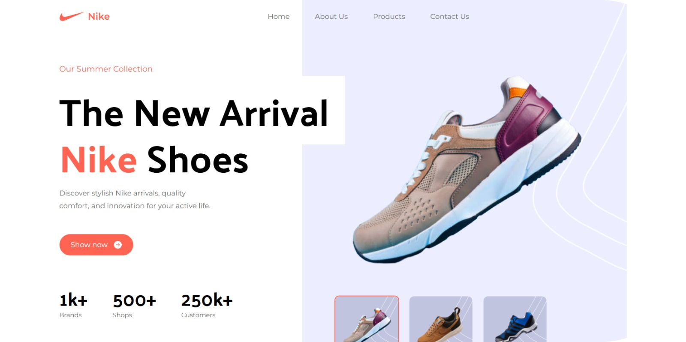

# Reademe-Default

<div align="center">
  <br />
        
  <br />
  <div>
    
    
  </div>
  <h3 align="center">Nike landing page</h3>

  <div align="center">
    Build your Nike landing page! 
   </div>
</div>

## 📋 <a name="table">Table of Contents</a>

1. 🤖 [Introduction](#introduction)
2. ⚙️ [Tech Stack](#tech-stack)

## <a name="introduction">🤖 Introduction</a>

A modern travel agency platform with an admin dashboard and public site. Generate AI-powered trip itineraries based on country, travel style, interests, group type, and budget — and book trips with ease.

If you're getting started and need assistance or face any bugs, join our active Discord community with over **50k+** members. It's a place where people help each other out.

## <a name="tech-stack">⚙️ Tech Stack</a>

- Tailwind CSS
- Vite
- React

## <a name="quick-start">🤸 Quick Start</a>

Follow these steps to set up the project locally on your machine.

**Prerequisites**

Make sure you have the following installed on your machine:

- [Git](https://git-scm.com/)
- [Node.js](https://nodejs.org/en)
- [npm](https://www.npmjs.com/) (Node Package Manager)

**Cloning the Repository**

```bash
git clone https://github.com/Lourenco-biel/nike.git
cd nike
```

**Installation**

Install the project dependencies using npm:

```bash
npm install
```

**Running the Project**

```bash
npm run dev
```

Open [http://localhost:5173](http://localhost:5173/) in your browser to view the project.
